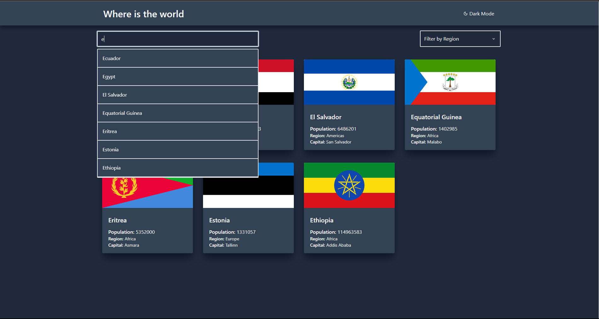

<h1 align="center">Countries</h1>

## Project Overview 🎉

I created this project from an idea from frontendmentor.io. From me, I added
autosuggestion in the search field. Build-in NextJs and all components of them
are styled in TailwindCSS.

## Tech/framework used 🔧

| Tech           | Description |
| -------------- | ----------- |
| NextJS         | SSG         |
| TailwindCSS    | Utility CSS |
| Rest Countries | APi         |

## Screenshots 📺

    

## Available scripts

| Command         | Description            |   
| --------------- | ---------------------- | 
| `npm run dev`   | Open local server      |    
| `npm run build` | Create optimized build |    
| `npm run start` | Start optimized build  |    
